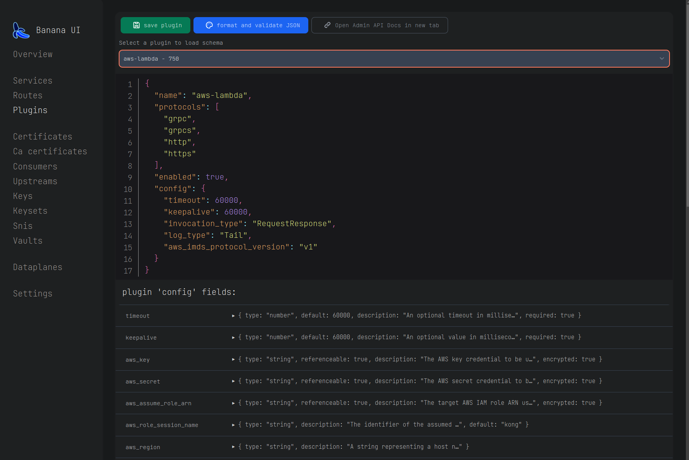

# Banana UI

## Live on Github Pages ->  [danielrailean.github.io/bananaui](https://danielrailean.github.io/bananaui/)

User interface (management UI) for Kong API gateway, with a focus on developer productivity and a great developer experience, alternative for Kong manager.

## features

- supports CRUD operation for all Kong entities
- handles the Admin API pagination properly and will fetch all the entities
- works both dynamically (check docker image) and statically -> all code is on the client side (neets a link to the Kong admin API and and whitelisting for CSRF in the API itself)
- dark mode (click on the banana)
- ease of navigation among linked Kong entities
- easy to CREATE/UPDATE entities -> access to the raw JSON body
- loads entity schema on CREATE, loads config schema for plugins
- copy buttons for all objects and object fields
- all links have anchor tags, which makes it easy to open in new tabs
- supports SSO login with an ID token.
- local settings stored in LocalStorage, when deploying the docker image, a default config can be provided in the env var, check ui/Readme
- built using Svelte.kit so easy to contribute to and extend.
- quite fast (thanks to Svelte) -> 99/100 lighthouse score
- all entity fields can be searched from the same seach window

## to be added

- caching of entities
- 'middleware' on different events, such as
  - trim part of the route on copy
  - append parts to the route on copy
- local user preferences
  - pagination chunk sizes
  - copy settings
  - visible fields for each entity, currently each entity has a default
- boolean AND searches among entities
- improvements to the add entity page.
- more OIDC flows -> auth user with secret in the backend (in case of dynamic deployment)
