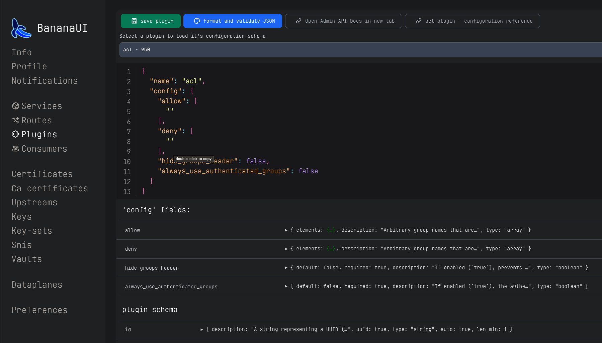

# BananaUI — Kong Gateway Admin UI

> **BananaUI** is a fast, open-source management UI for [Kong API Gateway](https://konghq.com/). It focuses on developer productivity and serves as a modern alternative to Kong Manager.

## Live Demo

[danielrailean.github.io/bananaui](https://danielrailean.github.io/bananaui/)

## What is BananaUI?

BananaUI is a web-based dashboard for managing Kong Gateway entities (services, routes, plugins, consumers, upstreams, etc.). It connects to the Kong Admin API and provides full CRUD operations, advanced filtering, and a responsive UI built with SvelteKit.

BananaUI can run as a **static site** (client-side only) or as a **Docker container** with server-side configuration.

## Features

### Entity Management

- **Full CRUD** for all Kong entities (services, routes, plugins, consumers, upstreams, targets, certificates, etc.)
- **Plugin execution order** — visualize plugin priority chain across services and routes with `→` arrows, click to expand config inline
- **Bulk create** — paste a JSON array of entities in the editor to create multiple entities in one go
- **Bulk update** — open the bulk editor from any entity list, write a JSON patch, and apply it to all currently filtered entities
- **Bulk delete** — remove all visible/filtered entities (hidden by default, gated behind a preference toggle). Three-stage confirmation with optional per-entity approval
- **Inline enable/disable toggle** — flip entity state directly from the list view or detail view with a single click (confirm dialog)
- **Schema-aware create/edit** — loads entity schemas and plugin config schemas automatically. Plugin selector sorted by priority with generated defaults
- **Syntax-highlighted JSON editor** with Prism.js — transparent textarea overlaid on highlighted `<pre>` block
- **Sub-entity navigation** — detail pages for services/upstreams automatically load child entities (routes, plugins, targets) inline with scoped "add" buttons
- **Data plane clustering info** — view sync status, versions, config hashes, and last-seen times across cluster nodes
- **Field ordering** — detail views sort fields in a consistent predefined order (id, name, enabled, tags, etc.)
- **Date formatting** — `created_at`, `updated_at`, `last_seen` rendered as relative times in lists ("2h ago") and formatted dates in detail views

### Copy Behavior

- **Single click = JSON, double click = YAML** — consistent across copy buttons for individual entities and "copy all"
- **"Copy all"** — copies all filtered entities with a confirm dialog showing count. Single click → JSON, double click → YAML
- **Double-click field values** — in both list and tree views, double-click any value to copy it
- **Double-click keys** — in tree view, double-click a key name to copy it (when enabled)
- **Detail page** — separate "copy JSON" and "copy YAML" buttons for the full entity

### Search & Filtering

- **Unified search** across all entity fields from a single search bar (matches against full JSON of each entity, case-insensitive)
- **Advanced filtering DSL**:
  - `,` — OR between groups (matches if any group passes)
  - `&&` — AND within a group (all conditions must pass)
  - `||` — OR within an AND block (any alternative matches)
  - `!` — NOT (excludes entities containing the term)
  - `.len == N` / `.len != N` — array field length checks
- **Evaluation precedence**: `||` → `&&` → `,`
- **Fuzzy search** — toggle Fuse.js-based typo-tolerant matching (all DSL operators still work)
- **URL persistence** — search text and sort state synced to URL query params via debounced `pushState`
- **Reference page** — built-in search syntax docs with examples, linked from the sidebar

### Column Sorting

- **Sort field dropdown** populated from entity keys
- **Sort direction toggle** (A→Z / Z→A)
- Handles strings (`localeCompare`), numbers, and objects (JSON-stringified)
- Sort state persisted in URL params

### Export & Copy

- **Copy as JSON or YAML** — export individual entities or entire lists
- **Copy buttons** on all objects and fields (single-click JSON, double-click YAML)

### Performance

- **Ephemeral GET cache** — configurable caching of API responses to reduce redundant calls
- **Proper Admin API pagination** — fetches all entities automatically via `next` cursor with configurable delay between requests. Load cancellation via timestamp comparison
- **99/100 Lighthouse score** — built with `SvelteKit` for blazing-fast rendering

### Customization

- **Fully configurable preferences** per user (editable as raw JSON):
  - API and UI pagination sizes
  - Visible fields per entity (`displayedFields`)
  - Default sort field and direction per entity
  - Default JSON values for new entities (`defaultAddValue`)
  - Plugin order display toggle
  - Entity enumeration (row numbers)
  - Custom entity definitions (names, API paths, fields, sort order, logos, sub-entities, sidebar visibility/spacing)
  - Custom HTTP headers for API requests
  - Fuzzy search toggle
  - Request cache toggle
  - Pagination delay between API requests
  - Bulk delete button visibility
- **Dark mode** — toggle via banana icon click (cycles: system → light → dark). Updates CSS variables for tree view colors. Blocks Dark Reader browser extension conflicts
- **Local settings** stored in `localStorage`; Docker deployments accept default config via env var (see [`ui/README.md`](./ui/README.md))
- **Versioned preferences** — on version mismatch, missing keys are backfilled from defaults

### Authentication & User Info

- **SSO / OIDC login** with ID token support
  - Auto-login mode: redirects automatically when `oidc.autoLogin` is true or `?auto=true` param is present
  - `state` parameter preserves the originating page URL for post-login redirect
  - Callback handles both query param and fragment-based token responses
  - Token expiry checking on click/keystroke — expired tokens auto-redirect to login with `?auto=true`
- **Profile page** — view decoded JWT payload, username, email, and personal API token with expiration. "Copy token" button with expiry toast
- **Notification history** — persistent log of errors, info, and success messages grouped by type, with timestamps. "Delete all" to clear

### Navigation & UX

- **Linked entity navigation** — jump between related Kong objects via anchor tags
- **Middle-click opens in new tab** — entity rows support `auxclick` to open in a new tab
- **Tree view** for nested objects with expandable fields and double-click-to-copy
- **Parent entity name resolution** — resolve foreign key IDs to human-readable names with call-once caching
- **Home/Info page** — displays Kong control plane info with plugins sorted by priority

### Developer Experience

- **Static or dynamic deployment** — works client-side with a Kong Admin API link, or via Docker image
- **Settings page** — raw JSON editor for connection config (static mode only), with format/validate
- **SvelteKit-based** — easy to extend and contribute to
- **Customizable entity definitions** — add new Kong entities without changing source code

## Deployment

| Method | Description |
|--------|-------------|
| **Static (GitHub Pages)** | Client-side only. Point BananaUI at your Kong Admin API URL. Requires CORS whitelisting on the Admin API. [Live demo](https://danielrailean.github.io/bananaui/) |
| **Docker** | Server-rendered. Configure via environment variables. See [`ui/README.md`](./ui/README.md). |

## Roadmap

- Event middleware (trim/append route parts on copy)
- Additional OIDC flows (backend secret-based auth for dynamic deployments)

## Keywords

Kong UI, Kong Gateway dashboard, Kong Admin API GUI, Kong manager alternative, BananaUI, open-source Kong management interface, SvelteKit Kong admin panel
